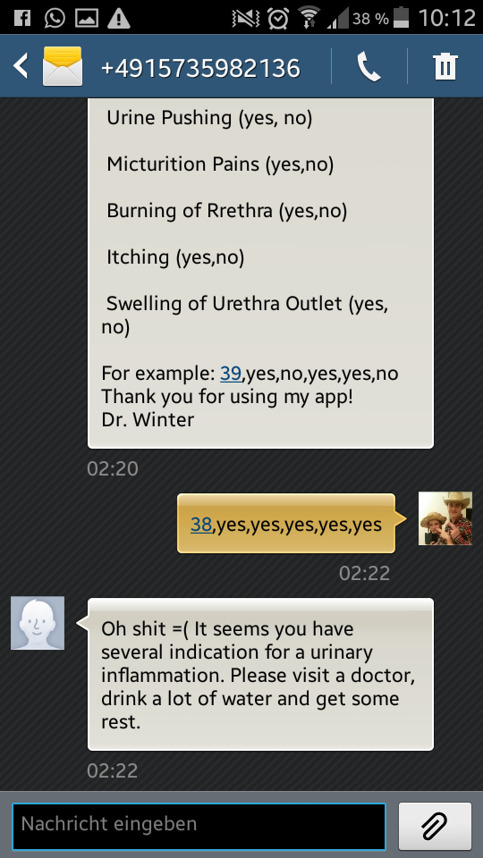

Dr Winter SMS Service
=====================

This is a first version of an interactive sms service. Due to missing datasets the application is currently only able to inform you about the risk of having urinary inflammation. The dataset was taken from:

> J.Czerniak, H.Zarzycki, Application of rough sets in the presumptive diagnosis of urinary system diseases, Artificial Intelligence and Security in Computing Systems, ACS'2002 9th International Conference Proceedings, Kluwer

**Try out our app in the following way:**

* Start by writing any mesasge like: "Hi" to +4915735982136

Our application will now reply with the instructions to use our service.

Now you need to specify your symptoms. Please do so by giving a decimal number with at most one decimal (e.g. 37.5) of your current temperature and yes/no answers for the other symptoms. All answers need to be seperated by comma or space.

**Now our app will internally predict your risk of urinary inflammation based on a trained random forest.**

It will answer you by telling you whether everything is alright or you need to visit a doctor.

Since this is only a prototype we can only predict urinary inflammation. It would be nice to expand the application by using natural language processing to look for symptoms in a text. Since the prediction of a disease only based on symptoms like a headache or itching is very hard and non-specific, we propose to merely predict whether your symptoms are potentionally serious or not and provide some information or advice.

